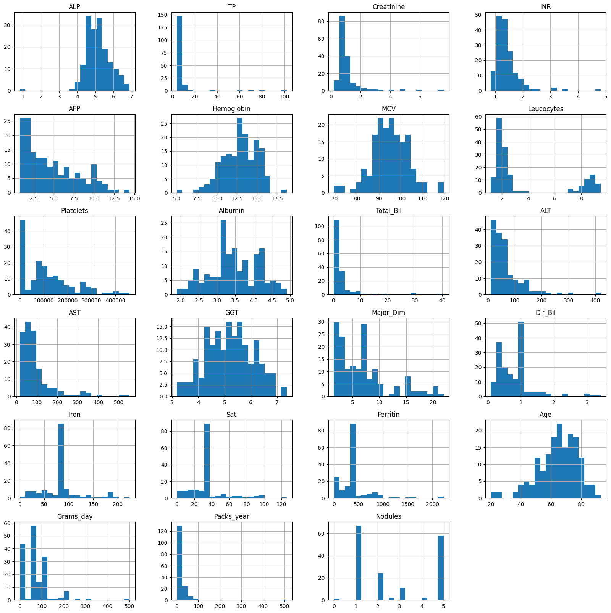
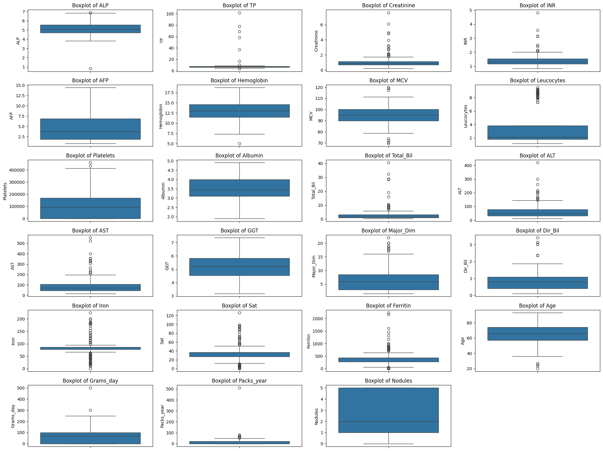
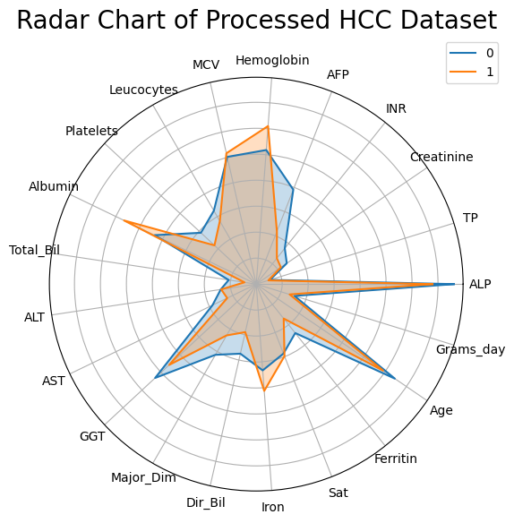
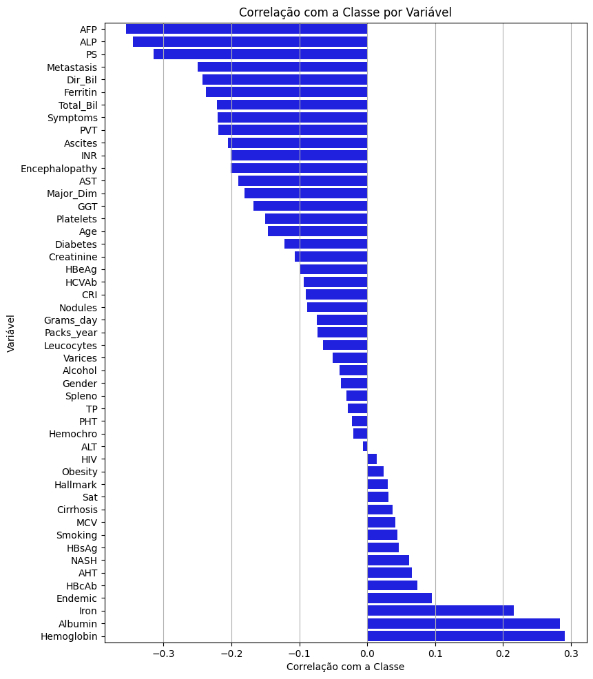
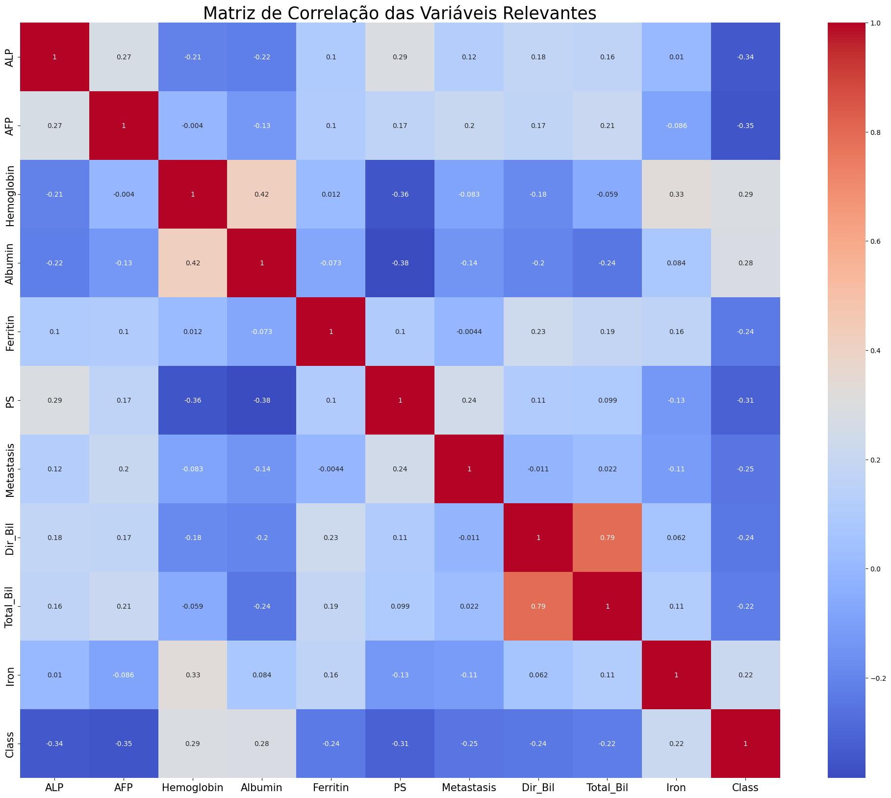
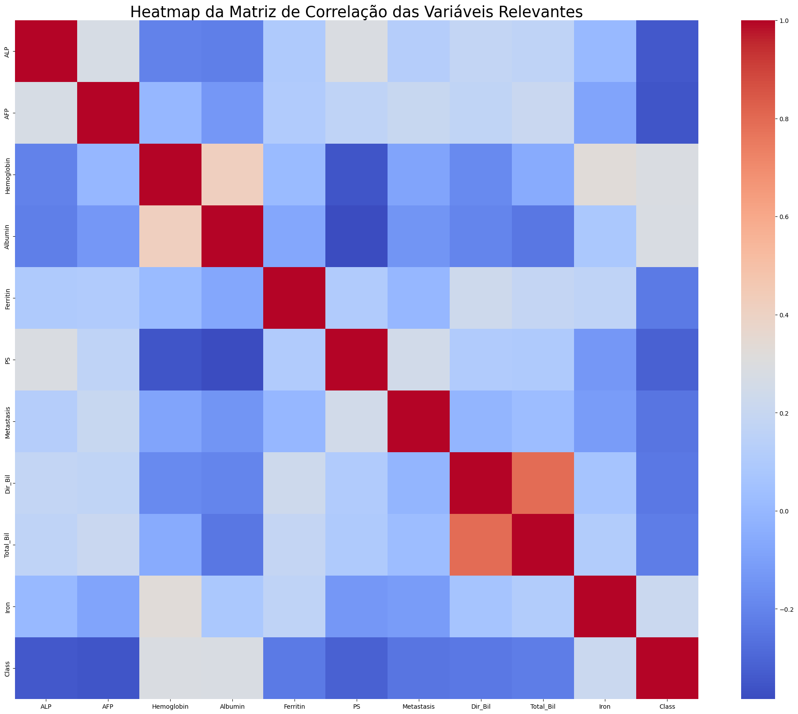
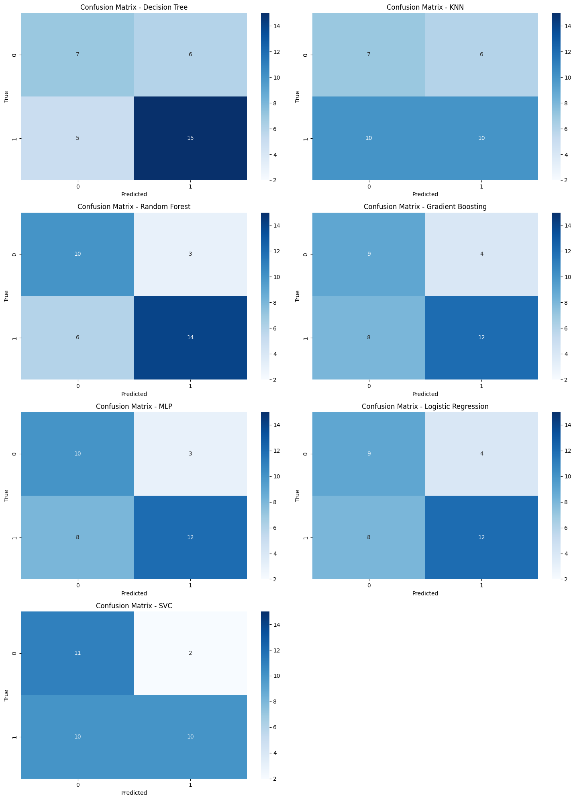
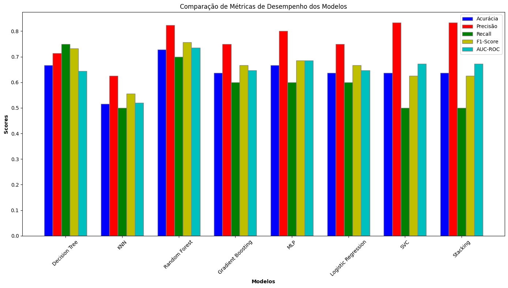
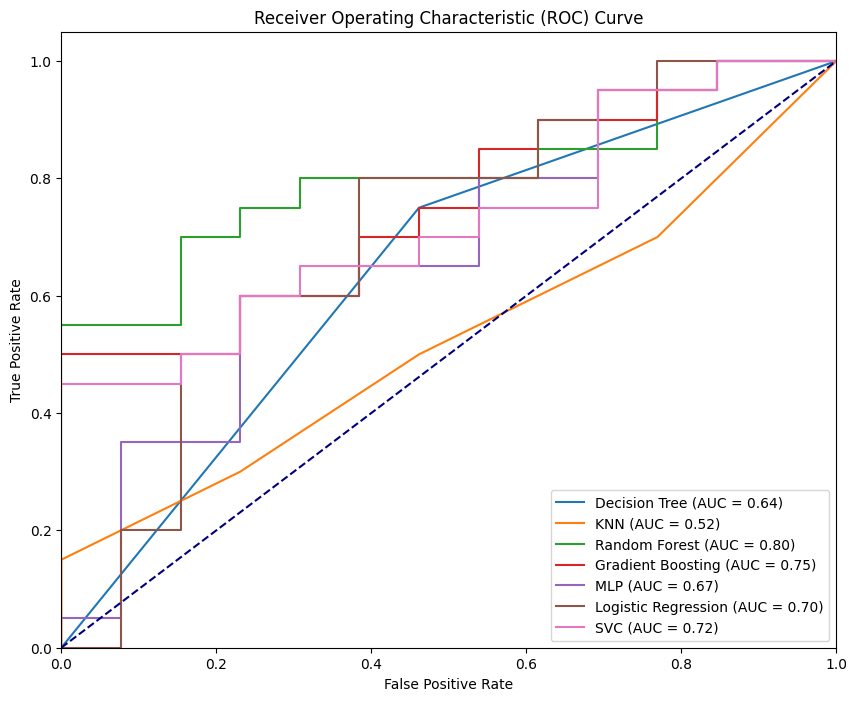
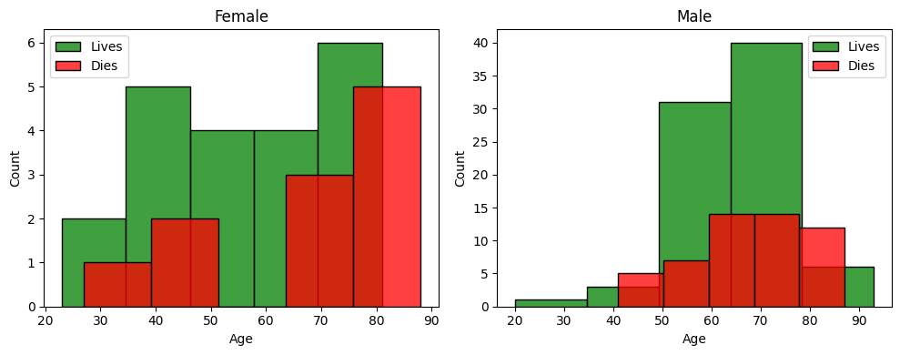

# HCC Survival Prediction

[](https://www.python.org/) 
[](./LICENSE)
[](https://jupyter.org/)
[](https://scikit-learn.org/)

End-to-end **Machine Learning pipeline** for predicting **1-year survival** of patients with **Hepatocellular Carcinoma (HCC)**, 
based on real clinical data collected at **CHUC — Coimbra Hospital and University Center (Portugal)**.

> Developed as part of the course *Elements of Artificial Intelligence and Data Science* (FCUP, 2023/24).

---

## ✨ Project Highlights
- **Exploratory Data Analysis (EDA):** histograms, boxplots, pie charts, correlation analysis, heatmaps and radar plots.
- **Data Preprocessing:** imputation, scaling, normalization, feature engineering; handling **class imbalance** with SMOTE.
- **Supervised Models:** Decision Tree, KNN, Random Forest, Gradient Boosting, Logistic Regression, MLP, SVC, and a Stacking ensemble.
- **Evaluation Metrics:** accuracy, precision, recall, F1-score, AUC-ROC, confusion matrices, and cross-validation.
- **Key Results:**  
  - **Random Forest** achieved the best performance (CV ≈ 0.74)  
  - **Gradient Boosting** followed closely (CV ≈ 0.70)  
  - **SVC** provided a strong baseline (CV ≈ 0.60)  

---

## 📂 Repository Structure
```
.
├── data/
│   └── README.md                 # Instructions for dataset placement (hcc_dataset.csv)
├── images/                       # Plots and visualizations generated during analysis
│   ├── histograms.png
│   ├── boxplots.png
│   ├── pie_survival.png
│   ├── radar_chart.png
│   ├── correlations.png
│   ├── correlation_matrix.png
│   ├── heatmap.png
│   ├── model_metrics.png
│   ├── roc_curves.png
│   ├── confusion_matrices.png
│   └── full_correlation_matrix.png
├── notebooks/
│   └── trabalho_HCD-2.ipynb      # Main notebook (EDA, preprocessing, models, evaluation)
├── reports/
│   ├── trabalho_HCD-2.pdf        # Final academic report
│   └── readme_original.pdf       # Original submission README
├── requirements.txt              # Python dependencies
├── LICENSE                       # MIT License
└── README.md                     # This file
```

---

## 📊 Visualizations

### Dataset Exploration
- Distribution of clinical variables  
  

- Outlier detection using boxplots  
  

- Survival vs Death percentages  
  

- Gender-based survival distribution  
  

### Correlation Analysis
- Feature correlation with target class  
  

- Correlation matrix (relevant variables)  
  

- Heatmap of relevant variables  
  

- Full correlation matrix (all variables)  
  

### Model Performance
- Model evaluation metrics comparison  
  

- ROC Curves  
  

- Confusion Matrices  
  

---

## ▶️ How to Run
1. Ensure **Python 3.10+** is installed.  
2. (Optional) Create a virtual environment:
   ```bash
   python -m venv .venv
   source .venv/bin/activate       # macOS/Linux
   .venv\Scripts\activate        # Windows
   ```
3. Install required dependencies:
   ```bash
   pip install -r requirements.txt
   ```
4. Place the dataset file `hcc_dataset.csv` in the `data/` folder (not included in this repo).  
5. Launch Jupyter Notebook and run:
   ```bash
   jupyter notebook notebooks/trabalho_HCD-2.ipynb
   ```

---

## 🔧 Dependencies
- pandas  
- numpy  
- matplotlib  
- seaborn  
- scikit-learn  
- imbalanced-learn  
- jupyter  
- ipykernel  

---

## 👩‍💻 Authors
- Catarina Abrantes  
- Liliana Silva  
- Mariana Fonseca  

---

## 📄 License
This project is licensed under the **MIT License** — see [LICENSE](./LICENSE) for details.
